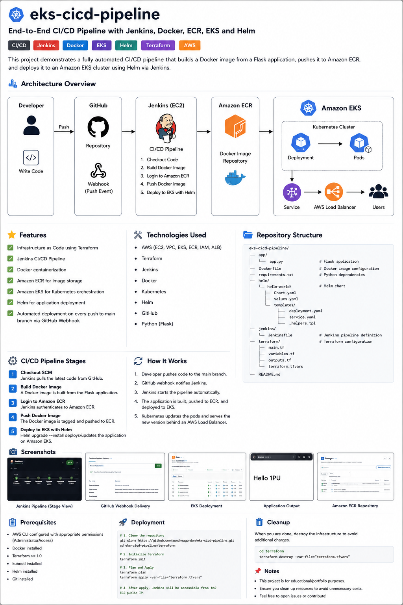
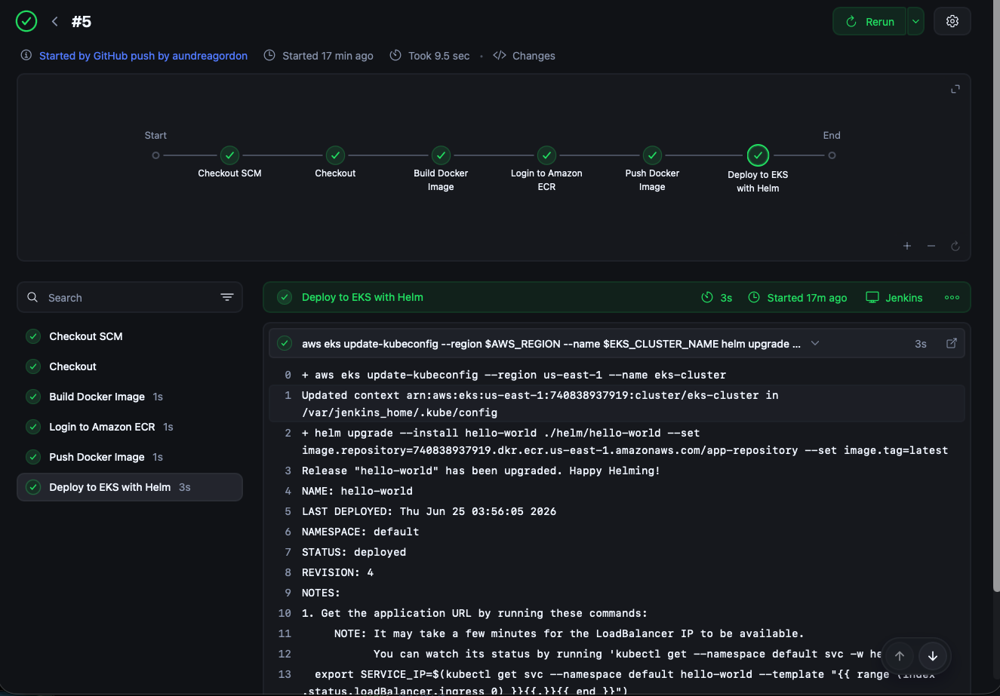
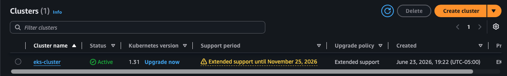
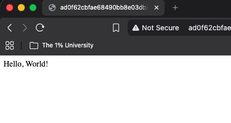
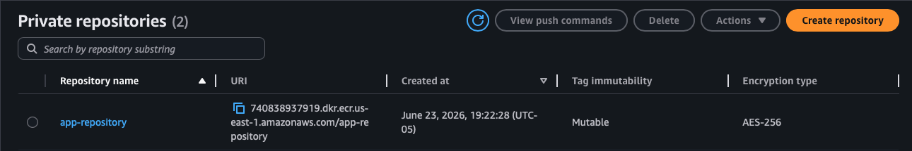

# 🚀 EKS CI/CD Pipeline

> **End-to-End CI/CD Pipeline using Jenkins, Docker, Amazon ECR, Amazon EKS, Helm, and Terraform**



---

# Overview

This project demonstrates a fully automated CI/CD pipeline that deploys a containerized Flask application to Amazon Elastic Kubernetes Service (EKS).

The infrastructure is provisioned entirely with Terraform, container images are built using Docker, stored in Amazon Elastic Container Registry (ECR), and deployed to Kubernetes using Helm. Jenkins orchestrates the entire deployment process.

Every push to the **main** branch automatically triggers a GitHub Webhook, which starts a Jenkins pipeline that:

* Checks out the latest source code
* Builds a new Docker image
* Authenticates with Amazon ECR
* Pushes the new image to ECR
* Deploys the updated application to Amazon EKS using Helm

The application is exposed externally through an AWS Application Load Balancer.

---

# Architecture


---

# CI/CD Workflow

```
Developer
    │
git push
    │
    ▼
GitHub Repository
    │
GitHub Webhook
    │
    ▼
Jenkins Pipeline
    │
    ├── Checkout Code
    ├── Build Docker Image
    ├── Login to Amazon ECR
    ├── Push Docker Image
    └── Deploy to Amazon EKS using Helm
    │
    ▼
Amazon EKS
    │
    ▼
AWS Load Balancer
    │
    ▼
Users
```

---

# Technologies Used

| Category                | Technology   |
| ----------------------- | ------------ |
| Cloud Platform          | AWS          |
| Containerization        | Docker       |
| Container Registry      | Amazon ECR   |
| Container Orchestration | Amazon EKS   |
| Package Management      | Helm         |
| Infrastructure as Code  | Terraform    |
| CI/CD                   | Jenkins      |
| Source Control          | Git & GitHub |
| Programming Language    | Python       |
| Framework               | Flask        |

---

# AWS Services

* Amazon EC2
* Amazon EKS
* Amazon ECR
* Amazon VPC
* IAM
* Security Groups
* Internet Gateway
* NAT Gateway
* Route Tables
* Elastic Load Balancer (ALB)

---

# Repository Structure

```text
eks-cicd-pipeline/
│
├── app/
│   ├── app.py
│   ├── Dockerfile
│   └── requirements.txt
│
├── terraform/
│   ├── provider.tf
│   ├── variables.tf
│   ├── vpc.tf
│   ├── iam.tf
│   ├── ecr.tf
│   ├── eks.tf
│   ├── ec2.tf
│   └── outputs.tf
│
├── helm/
│   └── hello-world/
│       ├── Chart.yaml
│       ├── values.yaml
│       └── templates/
│
├── jenkins/
│   └── Jenkinsfile
│
├── images/
│   ├── architecture.png
│   ├── pipeline.png
│   ├── webhook.png
│   ├── hello1pu.png
│   └── ecr.png
│
└── README.md
```

---

# Jenkins Pipeline Stages

| Stage                | Description                                       |
| -------------------- | ------------------------------------------------- |
| Checkout SCM         | Clone the GitHub repository                       |
| Build Docker Image   | Build the Docker image from the Flask application |
| Login to Amazon ECR  | Authenticate Docker with Amazon ECR               |
| Push Docker Image    | Push the image to the ECR repository              |
| Deploy to Amazon EKS | Deploy the updated image using Helm               |

---

# Screenshots

## Jenkins Pipeline



---

## GitHub Webhook


---

## Kubernetes Deployment



---

## Application



---

## Amazon ECR Repository



---

# Skills Demonstrated

* Infrastructure as Code using Terraform
* Kubernetes deployment using Amazon EKS
* Containerization with Docker
* Helm package management
* Amazon ECR image management
* Jenkins Pipeline automation
* GitHub Webhook integration
* Continuous Integration
* Continuous Deployment
* AWS Networking (VPC, Subnets, Route Tables, NAT Gateway)
* IAM Roles and Policies
* Kubernetes Services
* AWS Load Balancer
* End-to-end cloud deployment automation

---

# Deployment

Clone the repository

```bash
git clone https://github.com/aundreagordon/eks-cicd-pipeline.git
```

Initialize Terraform

```bash
terraform init
```

Review the execution plan

```bash
terraform plan
```

Provision the infrastructure

```bash
terraform apply
```

Build and deploy the application

The Jenkins pipeline automatically performs:

* Docker Build
* Docker Push to Amazon ECR
* Helm Upgrade
* Deployment to Amazon EKS

---

# Lessons Learned

Through this project I gained practical experience with:

* Designing an end-to-end CI/CD pipeline
* Building Docker images for containerized applications
* Automating deployments using Jenkins
* Managing infrastructure using Terraform
* Deploying workloads to Amazon EKS using Helm
* Integrating GitHub Webhooks with Jenkins
* Managing Kubernetes deployments
* Configuring AWS networking and IAM resources
* Troubleshooting CI/CD pipeline failures and Kubernetes deployments

---

# Future Improvements

* Deploy Jenkins using a custom Docker image with preinstalled tools
* Replace the **latest** image tag with Git commit SHA or Jenkins build numbers
* Implement Blue/Green deployments
* Add Trivy container vulnerability scanning
* Configure Prometheus and Grafana monitoring
* Install the Kubernetes Metrics Server for production-ready Horizontal Pod Autoscaling

---

# Cleanup

Destroy all AWS infrastructure when finished:

```bash
cd terraform
terraform destroy
```

---

# Author

**Aundrea Gordon**

AWS Cloud Engineer | DevOps Engineer

---

## License

This project is provided for educational and portfolio purposes.
